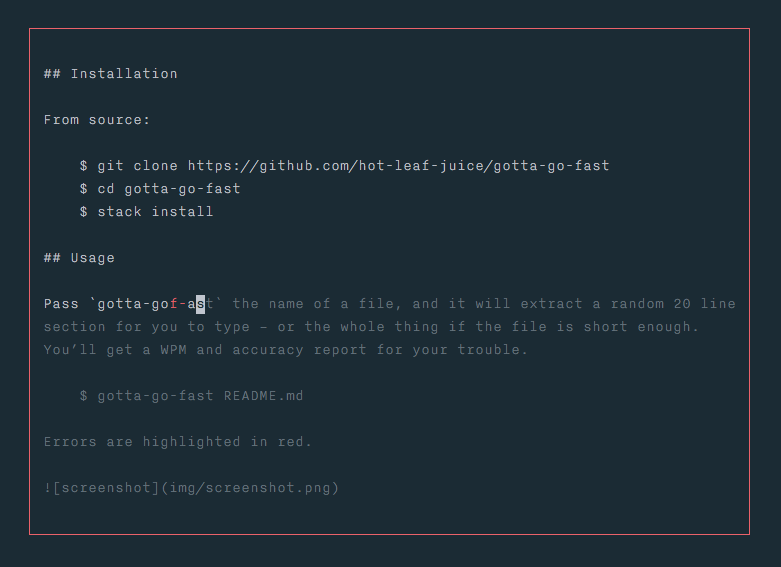

# Gotta Go Fast

A command line utility for practicing typing and measuring your WPM and
accuracy. Written with [brick](https://github.com/jtdaugherty/brick).

## Installation

With [Cabal](https://wiki.haskell.org/Cabal/How_to_install_a_Cabal_package):

    $ cabal install gotta-go-fast

From source:

    $ git clone https://github.com/hot-leaf-juice/gotta-go-fast
    $ cd gotta-go-fast
    $ stack install

If you’re on macOS, you can also grab an executable from
[releases](https://github.com/hot-leaf-juice/gotta-go-fast/releases).

## Usage

Pass `gotta-go-fast` the name of a file, and it will extract a random 20 line
section for you to type – or the whole thing if the file is short enough.
You’ll get a WPM and accuracy report after typing through the whole sample
*with no errors* (use backspace to go back and make corrections).

    $ gotta-go-fast README.md

Errors are highlighted in red.

Pass `gotta-go-fast` more than one file, and it will choose one at random.

    $ gotta-go-fast src/*

## Configuration

The maximum number of lines to sample, and the width at which to wrap them, can
be changed by setting `--height` and `--width`.

The colour for untyped text and the colour for errors can be changed by setting
`--fg-empty` and `--fg-error` to the appropriate [ISOColor
code](https://hackage.haskell.org/package/vty-5.15.1/docs/Graphics-Vty-Attributes.html#t:Color).
If you are greeted with a blank screen, you should try changing `--fg-empty`.

Run `gotta-go-fast --help` for details.
